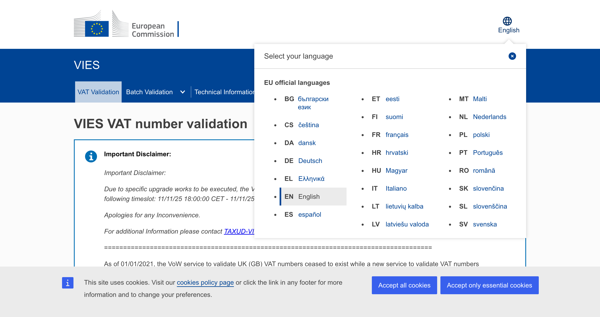
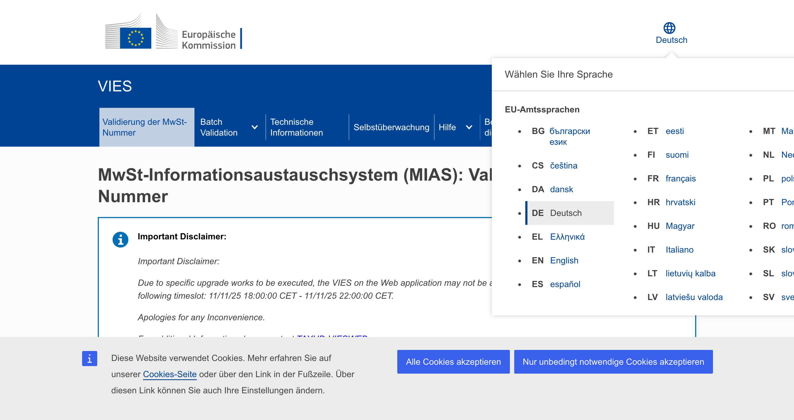
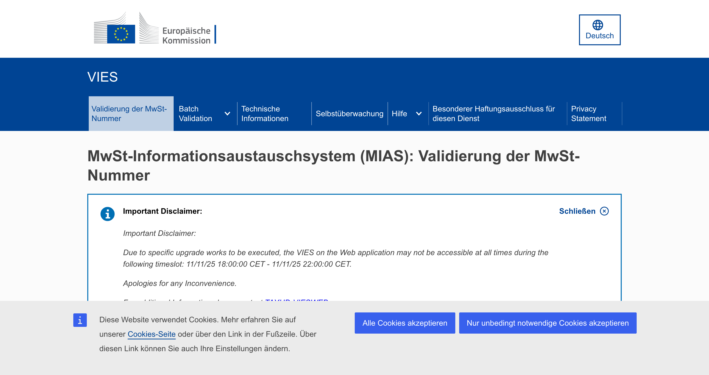

# BUG-001: Incomplete Translation After Language Switch

## Bug Summary
Partial or incomplete translation when switching from English to German (and likely other languages) on the VIES VAT Validation page. Some UI elements remain in English despite translation files being successfully loaded.

---

## Environment
- **URL**: https://ec.europa.eu/taxation_customs/vies/#/vat-validation
- **Application**: VIES on the Web
- **Version**: v7.2.1
- **Browser**: Google Chrome 142.0.0.0
- **OS**: macOS 24.6.0
- **Test Date**: November 7, 2025

---

## Severity & Priority
- **Severity**: Medium
- **Priority**: High
- **Type**: Localization/Translation Bug

**Justification**: While the application remains functional, incorrect or incomplete translations create a poor user experience and may cause confusion for non-English speaking users. This affects all EU language versions.

---

## Description
When a user switches the language from English to German (or any other supported language), the translation files are successfully fetched from the server but not fully applied to the page content. Several UI elements remain in English, creating an inconsistent and unprofessional user experience.

The bug affects multiple sections of the page including:
- Important disclaimer messages
- Navigation menu items
- Privacy-related links
- Form validation messages
- Accessibility labels

---

## Steps to Reproduce

1. Navigate to https://ec.europa.eu/taxation_customs/vies/#/vat-validation
2. Observe that the page loads in English by default
3. Click on the "Change language" button in the top navigation bar
4. Select "DE - Deutsch" from the language selector
5. Observe the page after language selection
6. (Optional) Interact with any form element to trigger UI updates

**Expected Result**: All UI elements should be displayed in German

**Actual Result**: The page shows mixed content with both German and English text

### Visual Evidence - Steps to Reproduce

**Step 1-2: Initial Page in English**


**Step 3-4: Language Selector**



**Step 5: Result - Mixed Language Content**


---

## Detailed Findings

### Elements Correctly Translated to German:
✅ Cookie banner: "Diese Website verwendet Cookies..."
✅ Main heading: "MwSt-Informationsaustauschsystem (MIAS): Validierung der MwSt-Nummer"
✅ Form labels: "Mitgliedstaat / Nordirland", "MwSt-Nummer"
✅ Submit button: "Prüfen"
✅ Navigation links: "Validierung der MwSt-Nummer", "Technische Informationen", "Selbstüberwachung"
✅ Footer links: "Europäische Kommission", "Datenschutzerklärung", "Impressum"
✅ Country names in dropdowns: "Deutschland", "Frankreich", "Spanien", etc.
✅ Language selector button: "Sprache ändern, aktuelle Sprache ist Deutsch"

### Elements NOT Translated (Remaining in English):
❌ Important disclaimer section:
   - "Important Disclaimer:"
   - "Due to specific upgrade works to be executed, the VIES on the Web application may not be accessible at all times during the following timeslot: 11/11/25 18:00:00 CET - 11/11/25 22:00:00 CET."
   - "Apologies for any Inconvenience."
   
❌ Brexit-related information:
   - "As of 01/01/2021, the VoW service to validate UK (GB) VAT numbers ceased to exist while a new service to validate VAT numbers of businesses operating under the Protocol on Ireland and Northern Ireland appeared..."

❌ Navigation items:
   - "Batch Validation"
   - "Privacy Statement"

❌ Accessibility labels:
   - "Access item's children" (appears on expandable menu items)

❌ Form validation messages:
   - "This field is required"

### Visual Comparison

**Partial Translation After User Interaction**



*Notice: Some elements like form labels are translated (German), but disclaimer and navigation items remain in English*

**Untranslated Form Validation**


*The validation message appears in English despite the page language being set to German*

**Final State Overview**



---

## Technical Analysis

### Network Activity
The following network requests confirm that translation files are being loaded correctly:

**Initial English load:**
- `GET /rest-api/translations?lang=en` → Status 200 ✅
- `GET /assets/i18n-eui/en.json` → Status 200 ✅
- `GET /assets/i18n-ecl/en.json` → Status 200 ✅

**After switching to German:**
- `GET /rest-api/translations?lang=de` → Status 200 ✅
- `GET /assets/i18n-eui/de.json` → Status 200 ✅
- `GET /assets/i18n-ecl/de.json` → Status 200 ✅

**Translation file content verification:**
The German translation file contains correct translations for UI elements:
```json
{
  "common_lbl_memberState": "Mitgliedstaat / Nordirland",
  "common_lbl_traderCity": "Ort",
  "menu_lbl_FAQ": "Fragen und Antworten (FAQ)",
  "common_lbl_postalCode": "Postleitzahl",
  "common_lbl_traderCompanyType": "Rechtsform",
  "exceptionError_lbl_TIMEOUT": "Zeitüberschreitung. Bitte wiederholen Sie Ihre Anfrage später."
}
```

### Console Messages
Minor errors detected (non-critical):
```
WTINFO: container doesn't exist
WTERROR: Europa Analytics, missing 'siteID' parameter
```

### Local Storage
Language preference is correctly saved:
```
localStorage.getItem('language') = "de"
```

---

## Root Cause Analysis

Based on the investigation, the issue appears to be caused by:

1. **Hardcoded Content**: Some content (particularly the disclaimer messages) appears to be hardcoded in HTML rather than using translation keys. Example found in DOM:
   ```html
   <div class="ecl-message__title">Important Disclaimer:</div>
   ```

2. **Lazy Translation Application**: Translations are only applied to certain UI elements after user interaction (e.g., clicking on a dropdown), suggesting the translation mechanism is triggered by specific events rather than globally on language change.

3. **Missing Translation Keys**: Some UI elements like "Access item's children" and "Privacy Statement" may not have corresponding translation keys in the translation files.

4. **Asynchronous Loading Issue**: The translation files load successfully, but the UI does not re-render or update all components to apply the new translations.

---

## Recommendations

### Immediate Fixes:
1. Replace all hardcoded English text with translation keys
2. Implement a global re-render or digest cycle when language is changed
3. Add missing translation keys for all UI elements
4. Ensure all dynamic content (like disclaimers from API) supports multilingual responses

### Long-term Improvements:
1. Add automated tests to verify all UI elements are translated
2. Implement a translation coverage report
3. Add visual regression tests for each supported language
4. Consider using a translation management system (TMS)
5. Review and standardize the i18n implementation across the application

---

## Evidence

All screenshots documenting the issue have been embedded throughout this report. For reference, here is the complete set:

### Screenshot Gallery

| Screenshot | Description |
|------------|-------------|
|  | **1. Initial Page Load** - Page correctly displayed in English before language switch |
|  | **2. Language Selector** - User selecting German (DE - Deutsch) from available languages |
|  | **3. Immediate After Switch** - Page showing minimal translation applied, most content still in English |
|  | **4. Partial Translation** - After user interaction, some elements translate but others remain in English |
|  | **5. Untranslated Validation** - Form validation message "This field is required" appears in English |
|  | **6. Final State** - Overall view showing the mixed German/English content issue |

---

## Impact Assessment

**Affected Users**: All non-English speaking users across all 24 EU languages

**Business Impact**:
- Poor user experience for international users
- Potential confusion and reduced trust in the service
- Non-compliance with EU multilingual requirements
- Accessibility concerns for users who don't speak English

**Frequency**: 100% reproducible across all language switches

---

## Proposed Solution

1. Audit all static content in the application and replace with translation keys
2. Implement proper change detection when language is switched to ensure all components re-render with new translations
3. Add comprehensive translation tests
4. Update API endpoints to return translated content based on current language
5. Implement a fallback mechanism to English if translation is missing

---

## Additional Notes

- The bug affects the entire application, not just the VAT Validation page
- Similar issues likely exist on other pages (Technical Information, Help, etc.)
- The translation infrastructure appears to be in place, suggesting this is a rendering/application issue rather than a data problem
- Page refresh does NOT fix the issue; translations remain incomplete

---

**Reported by**: QA Engineer
**Date**: November 7, 2025
**Status**: New
